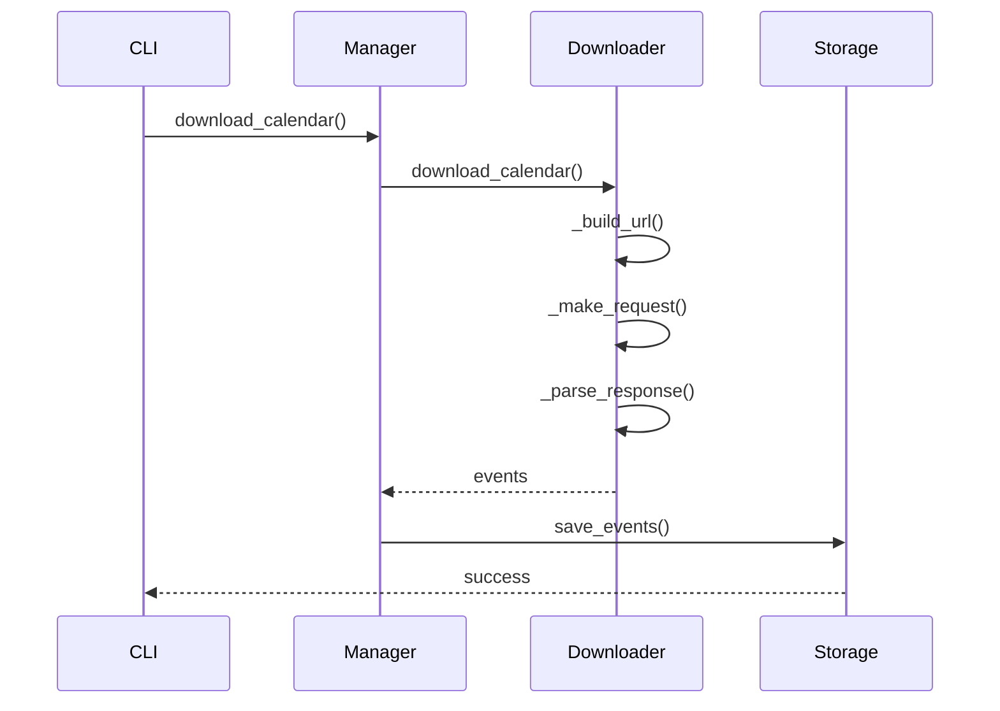
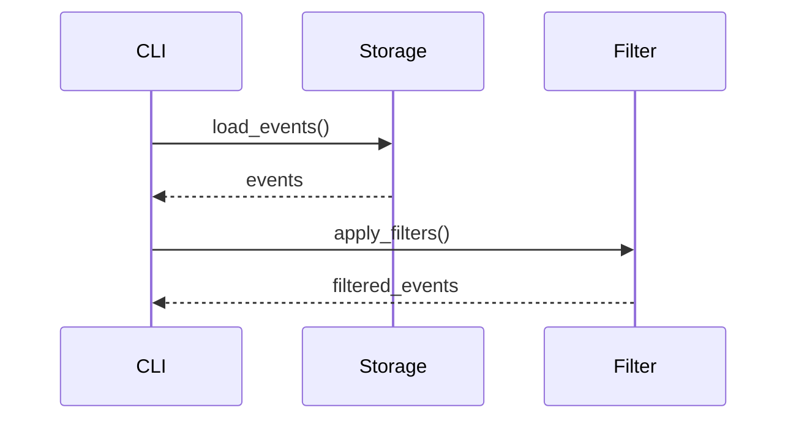

# 系统架构设计

## 整体架构

系统采用模块化、插件式架构设计，主要包含以下核心模块：

```
src/
├── downloader/        # 下载器模块
├── models/           # 数据模型
├── utils/           # 工具类
├── config/          # 配置管理
├── database/        # 数据存储
└── cli/            # 命令行接口
```

### 核心模块职责

1. 下载器模块 (downloader/)
   - 负责从各数据源获取财经日历数据
   - 实现数据解析和清洗
   - 提供统一的下载接口

2. 数据模型 (models/)
   - 定义数据结构
   - 实现数据验证
   - 提供数据转换方法

3. 工具类 (utils/)
   - 提供通用工具函数
   - 实现HTTP请求封装
   - 提供日期处理工具

4. 配置管理 (config/)
   - 管理系统配置
   - 提供配置验证
   - 支持环境变量覆盖

5. 数据存储 (database/)
   - 实现数据持久化
   - 提供数据查询接口
   - 管理数据版本

6. 命令行接口 (cli/)
   - 提供命令行工具
   - 实现参数解析
   - 处理用户交互

## 详细设计

### 1. 下载器模块

#### 1.1 基础下载器 (示例)

```python
# 移除 BaseDownloader 类定义示例
# class BaseDownloader:
#     def __init__(self, name: str):
#         self.name = name
#     
#     def download_calendar(self, start_date: datetime,
#                          end_date: datetime,
#                          importance: List[int] = None) -> List[EconomicEvent]:
#         raise NotImplementedError

# 可以保留文字说明，说明下载器应有的基本接口或功能
# 例如：下载器应提供一个方法来下载指定日期范围的日历数据。
print("Downloader should provide a method to download calendar data for a date range.")
```

#### 1.2 下载器管理器 (示例)

```python
class CalendarManager:
    def __init__(self):
        self.downloaders = {} # 存储具体的下载器实例或类
    
    def register_downloader(self, name: str, downloader):
        # 移除类型提示: BaseDownloader
        self.downloaders[name] = downloader
    
    def download_calendar(self, source: str, **kwargs) -> List[EconomicEvent]:
        if source not in self.downloaders:
            raise ValueError(f"未知数据源: {source}")
        # 假设注册的 downloader 有 download_calendar 方法
        return self.downloaders[source].download_calendar(**kwargs)
```

### 2. 数据模型

#### 2.1 事件模型

```python
@dataclass
class EconomicEvent:
    date: datetime
    name: str
    importance: int
    country: str = ""
    actual: str = ""
    forecast: str = ""
    previous: str = ""
    
    def validate(self) -> bool:
        if not self.date:
            return False
        if not self.name:
            return False
        if not 1 <= self.importance <= 3:
            return False
        return True
```

### 3. 配置管理

#### 3.1 配置加载

```python
class Config:
    def __init__(self):
        self.settings = {}
    
    def load_from_file(self, path: str):
        with open(path) as f:
            self.settings.update(yaml.safe_load(f))
    
    def load_from_env(self):
        for key, value in os.environ.items():
            if key.startswith('APP_'):
                self.settings[key[4:].lower()] = value
```

### 4. 数据存储

#### 4.1 存储接口

```python
class Storage(ABC):
    @abstractmethod
    def save_events(self, events: List[EconomicEvent]):
        pass
    
    @abstractmethod
    def load_events(self, start_date: datetime,
                   end_date: datetime) -> List[EconomicEvent]:
        pass
```

#### 4.2 CSV存储实现

```python
class CSVStorage(Storage):
    def __init__(self, path: str):
        self.path = path
    
    def save_events(self, events: List[EconomicEvent]):
        df = pd.DataFrame([e.__dict__ for e in events])
        df.to_csv(self.path, index=False)
    
    def load_events(self, start_date: datetime,
                   end_date: datetime) -> List[EconomicEvent]:
        df = pd.read_csv(self.path)
        df['date'] = pd.to_datetime(df['date'])
        mask = (df['date'] >= start_date) & (df['date'] <= end_date)
        return [EconomicEvent(**row) for row in df[mask].to_dict('records')]
```

## 数据流

### 1. 下载流程



### 2. 查询流程



## 扩展机制

### 1. 新增数据源

1. 实现下载器类（无需继承特定基类，但需包含如`download_calendar`的方法）
2. 实现必要方法（如数据解析、请求等）
3. 注册到 CalendarManager (如果使用管理器模式)

### 2. 新增存储方式

1. 继承 Storage
2. 实现存储接口
3. 配置存储类型

### 3. 新增过滤器

1. 继承 BaseFilter
2. 实现过滤逻辑
3. 注册到 FilterChain

## 部署架构

### 1. 单机部署

```
[Client] -> [CLI] -> [Application] -> [Local Storage]
```

### 2. 分布式部署

```
[Client] -> [API Gateway]
            |
            +-> [Download Service 1] -> [Cache]
            |
            +-> [Download Service 2] -> [Cache]
            |
            +-> [Storage Service] -> [Database]
```

## 安全机制

### 1. 数据源访问

- 使用代理池
- 实现请求限流
- 添加请求重试

### 2. 数据存储

- 数据加密存储
- 访问权限控制
- 数据备份机制

### 3. 配置管理

- 敏感配置加密
- 环境变量注入
- 配置版本控制

## 监控告警

### 1. 性能监控

- 下载耗时统计
- 内存使用监控
- CPU使用监控

### 2. 错误监控

- 异常日志记录
- 错误率统计
- 告警通知

### 3. 业务监控

- 数据完整性检查
- 数据准确性验证
- 数据延迟统计

## 后续规划

### 1. 功能增强

- [ ] 支持更多数据源
- [ ] 优化数据解析性能
- [ ] 添加数据分析功能

### 2. 架构优化

- [ ] 引入消息队列
- [ ] 实现分布式部署
- [ ] 优化缓存机制

### 3. 运维支持

- [ ] 完善监控系统
- [ ] 自动化部署
- [ ] 容器化支持 